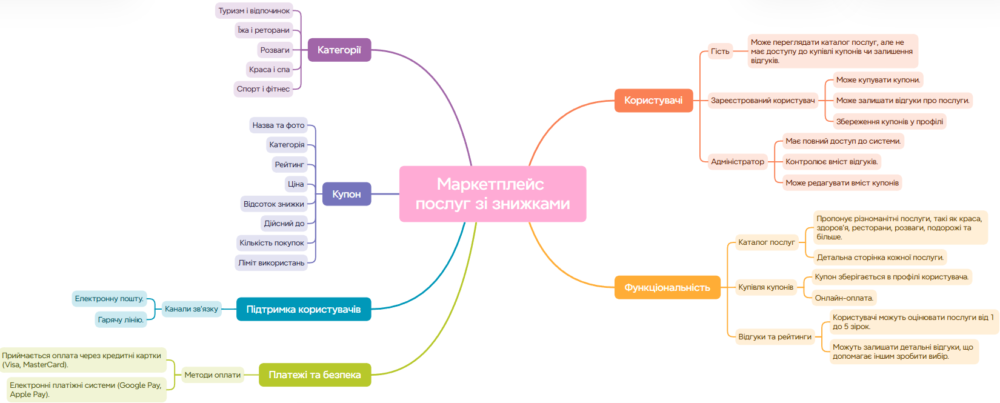

# 📉 Маркетплейс послуг зі знижками

## 🔍 Актуальність теми

Сучасні споживачі активно шукають способи економії коштів на товарах і послугах. В умовах високої конкуренції між бізнесами маркетплейси зі знижками стали ефективним інструментом для залучення клієнтів і збільшення продажів. Вони дозволяють користувачам швидко знаходити вигідні пропозиції, а підприємцям – ефективно просувати свої послуги.

Згідно зі статистикою [1], понад **60% онлайн-покупців шукають знижки** перед здійсненням покупки, а ринок купонних сервісів зростає на **6–8% щорічно**. Це свідчить про актуальність розробки маркетплейсу, який об’єднує покупців та бізнеси для взаємовигідної співпраці.

---

## 👥 Потенційні користувачі

- **Звичайні користувачі** – шукають знижки на послуги, купують купони.
- **Адміністратори платформи** – забезпечують модерацію контенту та підтримку користувачів.

---

## 🔍 Аналіз аналогічних сервісів

| Сервіс       | Опис                                                                 |
|--------------|----------------------------------------------------------------------|
| Groupon[2] | Міжнародна платформа купівлі купонів на товари та послуги зі знижками. |
| Pokupon[3] | Український сервіс, що пропонує акції у сфері краси, подорожей, розваг. |
| LoveSales[4] | Платформа для моніторингу знижок у популярних магазинах.             |

---

## 🧰 Стек технологій

- **Мова програмування**: `C#` – основна мова розробки застосунку.
- **Графічний інтерфейс**: `WPF (Windows Presentation Foundation)`.
- **Зберігання даних**: `JSON`.
- **Контроль версій**: `GitHub`.
- **Інструменти дизайну та моделювання**:
  - `Figma` – створення інтерфейсу користувача.
  - `Draw.io` – побудова UML-діаграм.
  - `XMind` – візуалізація структури проєкту (Mind Map).

---

## 🧠 Mind Map проєкту

> Побудована за допомогою XMind для кращого розуміння предметної області – **Маркетплейсу послуг зі знижками**.

 

---

## 🔗 Посилання

1. Ecommerce Statistics 2023: How Consumers Shop Online. Statista, 2023. [📎 Доступ](https://www.statista.com)
2. [Groupon – Official Site](https://www.groupon.com)
3. [Pokupon – Знижки та акції в Україні](https://pokupon.ua)
4. [LoveSales – Сервіс відстеження знижок](https://www.lovesales.com)

---

> 👨‍💻 Розроблено як навчальний проєкт з метою опанування основ побудови десктопних додатків з використанням сучасних технологій.

